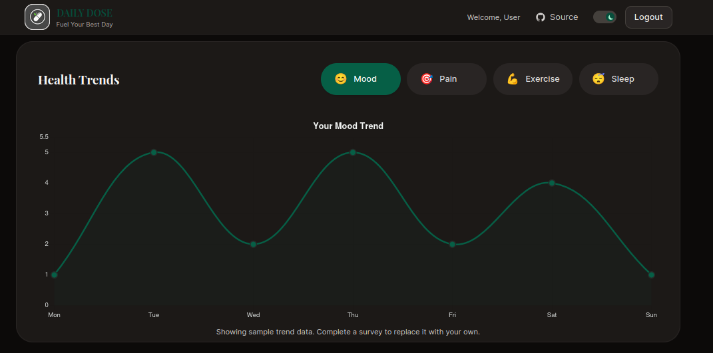

# 💊 Daily Dose 🌿

[](https://daily-dose-weld.vercel.app)



Daily Dose is a front-end web application I built to learn Google Cloud services and the Gemini API. It provides basic health tracking features, data visualization, and AI-generated medical task lists based on user input.

**Architecture Note:** To keep the scope focused on API integration and front-end development, this project is completely stateless. All user data (surveys, generated tasks) is stored locally in the browser via `localStorage`. There is no backend database.

## Features

* **AI Medical Parser:** Uses Gemini to generate medical tasks based on user's symptoms.
* **Calendar Integration:** Generates stateless Google Calendar links for scheduling generated medical tasks.
* **Daily survey:** Prompts the user daily for a survey and records and analyze metrics for chart visualization and medical tasks generation.
* **Data Visualization:** Uses Chart.js to display a rolling window of health metrics obtained from the daily health survey.
* **Medication Tracker:** A client-side list to log and manage active prescriptions.
* **Theming:** Includes a custom light/dark mode implementation built with Tailwind CSS.

## Tech Stack

* **Framework:** [Next.js](https://nextjs.org/)
* **Language:** [TypeScript](https://www.typescriptlang.org/)
* **Styling:** [Tailwind CSS](https://tailwindcss.com/)
* **AI:** [Google Gemini API](https://ai.google.dev/)
* **Charts:** [Chart.js](https://www.chartjs.org/)
* **Deployment:** [Vercel](https://vercel.com/)

## Local Setup

### Prerequisites
* Node.js 18.x or later
* Google AI Studio API Key ([Get one here](https://aistudio.google.com/))

### Installation

1.  **Clone the repository:**
    ```bash
    git clone https://github.com/BillPotato/daily-dose.git
    cd daily-dose
    ```

2.  **Install dependencies:**
    ```bash
    npm install
    ```

3.  **Set up Environment Variables:**
    Create a `.env.local` file in the root directory:
    ```env
    GEMINI_API_KEY=your_api_key_here
    ```

4.  **Run the development server:**
    ```bash
    npm run dev
    ```
    Open [http://localhost:3000](http://localhost:3000).

## License

This project is licensed under the MIT License.

## Author

**Bill Nguyen** *Student, University of South Florida* [GitHub](https://github.com/BillPotato)